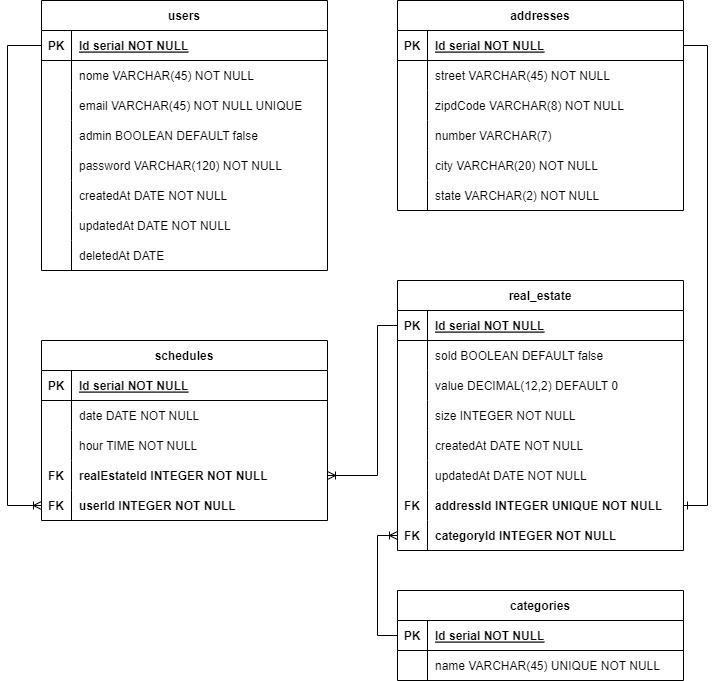

# KImóveis - Gerenciamento de serviços

## Introdução:

KImóveis é um projeto back end que através da aplicação é possível realizar o cadastro de imóveis e de usuários interessados na aquisição de propriedades. Além disso, é possível realizar o agendamento e consultar horários de visitas às propriedades disponíveis no banco de dados da imobiliária.  

## Tecnologias:

As tecnologias foram cuidadosamente selecionadas com base nas diretrizes e requisitos específicos estabelecidos para o desenvolvimento. O projeto foi concebido em Node.js com TypeORM para melhor interação com o banco de dados. Inicialmente pensado para aplicação com banco de dados PostgresSQL também possui script definido para utilização de SQLite3 para testes no ambiente de desenvolvimento. Na segurança e autenticação foram utilizado as bibliotecas bcryptjs, jsonwebtoken e zod. O projeto também possui testes automatizados com Jest.

## Modelo entidade relacionamento:

## Endpoints:

| Método | Endpoint                   | Responsabilidade                                  | Autenticação                           |
| ------ | -------------------------- | ------------------------------------------------- | -------------------------------------- |
| POST   | /users                     | Criação de usuário                                | Qualquer usuário, não necessita token  |
| GET    | /users                     | Lista todos os usuários                           | Apenas Admnistradores                  |
| PATCH  | /users/:id                 | Atualiza um usuário                               | Apenas Admnistradores ou dono da conta |
| DELETE | /users/:id                 | Realiza um soft delete no usuário                 | Apenas Admnistradores                  |
| POST   | /login                     | Gera o token de autenticação                      | Qualquer usuário, não necessita token  |
| POST   | /categories                | Criação de categoria                              | Apenas Admnistradores                  |
| GET    | /categories                | Lista todas as categorias                         | Qualquer usuário, não necessita token  |
| GET    | /categories/:id/realEstate | Lista todos imóveis que pertencem a uma categoria | Qualquer usuário, não necessita token  |
| POST   | /realEstate                | Criação de um imóvel                              | Apenas Admnistradores                  |
| GET    | /realEstate                | Lista todos os imóveis                            | Qualquer usuário, não necessita token  |
| POST   | /schedules                 | Agenda uma visita a um imóvel                     | Qualquer usuário, obrigatório token    |
| GET    | /schedules/realEstate/:id  | lista todos os agendamentos de um imóvel          | Apenas Admnistradores                  |

## Instalação:

Para instalação é obrigatório que tenha o Node.js/Npm instalados localmente na sua máquina  
Para verificar se estão instalados corretamente utilize:  
`` node --version && npm --version ``
 

Agora para instalar as depedências do projeto utilize:  
`` npm install ``
 

Caso tenha interesse em rodar apenas o ambiente de desenvolvimento com SQLITE3 comente o código da configuração do banco em Postgres do TypeORM e apenas preencha a chave secreta nas variáveis de ambiente. Agora caso tenha interesse em rodar no banco ideal, além da configuração da chave secreta adicione também URL da database nas variáveis de ambiente seguindo o exemplo.  

Com o banco configurado e endereçado as variáveis de ambiente aplique as migrações para o seu banco, criado as tabelas e seus relacionamento com:  
`` npm run typeorm migration:run -- -d ./src/data-source ``
 

E pronto, basta rodar o seguinte comando e a aplicação já estará rodando localmente:  
`` ǹpm run dev ``

## Insomnia:

